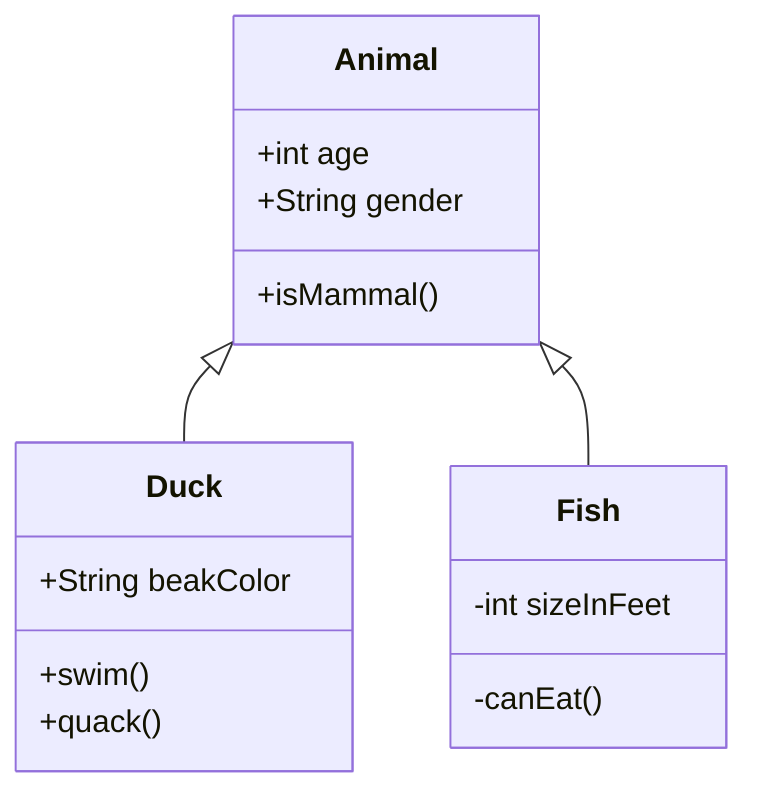

# Class diagram using markdown preview mermaid support vscode extension 

```mermaid
classDiagram
Animal <|-- Duck
Animal <|-- Fish
Animal : +int age
Animal : +String gender
Animal : +isMammal()

class Duck{
    +String beakColor
    +swim()
    +quack()
}
class Fish{
    -int sizeInFeet
    -canEat()
}
```